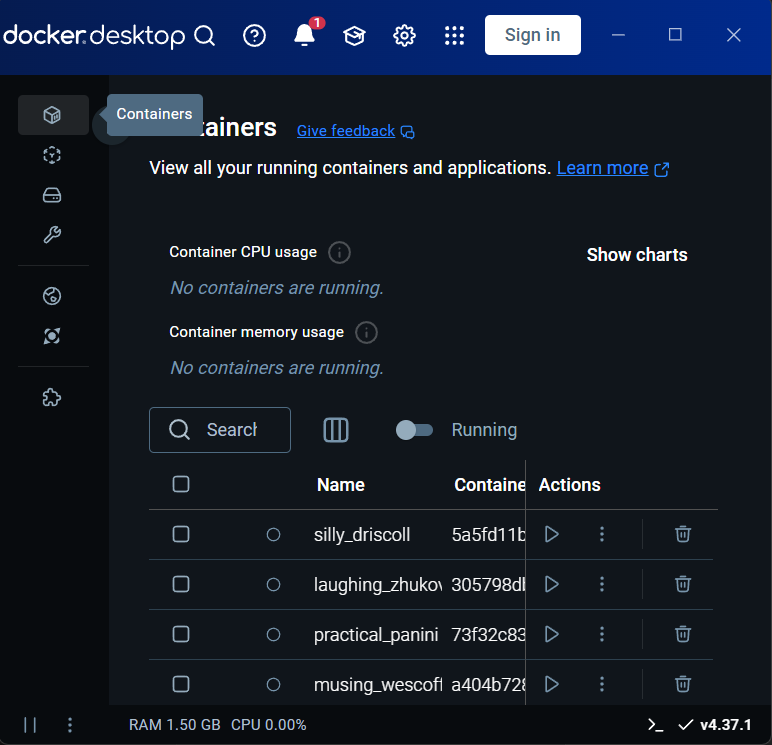
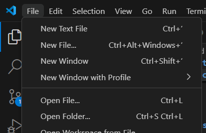
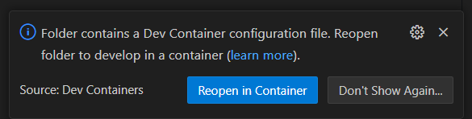

# Rust HAL

This is our HAL, a Rust library aimed at allowing embedded software developers to leverage the capabilities of their hardware by providing a common abstraction.

So far, our HAL supports the following features:

 - GPIO
 - USART
 - SPI
 - I2C

Examples are provided to show use cases as well as to explain how to use the library. More details are available in [*Exemples*](#exemples).

It is possible to run the examples with an emulator such as QEMU or Renode. More details are available in 

## Supported targets

So far, the following targets are supported:

 - The Atmega328P MCU
 - The STM32F1xxxx MCU family (running on the Cortex-M3 CPU)

The main reason for choosing the STM32F1 family of MCUs is that they run on the Cortex-M3, which is better supported by Rust than the Atmega328P. In addition, they are supported by Renode, an emulation tool that provides a more streamlined workflow and more advanced features than QEMU. For instance, we can define our own peripherals in C#, connect additional devices to any microcontroller, see the connection status and the exchanged data, etc.

## Installing the dependencies / running the development environment

The project folder contains a `.devcontainer` folder. This folder, and the file it contains, allows IDEs such as VS Code to open the project in a Docker container (*i.e*. a virtual machine). **This is extremely useful.** It makes it possible to define the OS, the extensions and the programs used to work on the library. They are then automatically installed in the container (the VM) on first opening the folder. The terminal executes commands only in the VM, and this makes it possible to use programs installed in the VM, and the same goes for extensions that rely on specific software being installed (such as Rust-Analyzer requiring Rust).

Here’s a step by step guide with VS Code.

1. First, install Docker. On Windows, you need to download and install Docker Desktop.
2. Run Docker Desktop, so that the Docker daemon is running. You can then minimise the Docker Desktop window or even close the window, Docker will continue running in the background.

3. Open VS Code and open the project folder.

4. You should see the "Reopen in Container" message appear. Click to switch to the Dev Container.

The end result is that VS Code, while running on your host computer, runs as if it was connected to the exact same device that was used to develop this HAL. This guarantees you have the exact same software installed, the same extensions, etc.

If you do not want to use a Dev Container, you can read the `Dockerfile` file and see what software needs to be installed, and how it is installed.

## Exemples

Examples are provided in the `examples/` folder. They showcase how to use the library to use specific features: I2C, SPI, USART and GPIO.

### Building the example

Building an example is veary simple. The example and the target must be specified when invoking `cargo build`. For instance:

    cargo build --example gpio --target thumbv7m-none-eabi

### Running the example

#### For the Atmega328P

QEMU is used to emulate the Atmega328P. It can be used to run the examples without hardware.

Run `cargo run --example usart --target atmega328p.json` from one terminal, and `telnet localhost 5678` from another. All the characters you send will be sent back to you over USART.

## Test for the STM32F1

The STM32F1 target was chosen because it is supported by **Renode**.

Renode is a very, very useful software for testing embedded software. It is very easy to extend, or to define complex configurations with multiple devices attached to the same MCU.

Renode is already installed in the Dev Container. If you are not using the Dev Container you need to install it.

You first need to build an example for the STM32F1. For instance, for the I2C, `cargo build --example i2c --target thumbv7m-none-eabi`.

Then, run Renode:

1. `renode --console`
2. `include @renode/i2c.resc`

We are then able to check that there is a SPI communication between our ficticious STM32F1 and our virtual BME280 sensor!

    22:10:46.9569 [NOISY] i2c1.bme280: Write D0
    22:10:46.9590 [NOISY] i2c1.bme280: Read 60

Here, we queried the sensor for its device ID, and it correctly returned `60`.

To pause the simulation, type `pause` or `p` then press "Enter". To quit renode, type `quit` or `q` then press "Enter".

The same prodecure can be applied for testing the GPIO.

For the USART, the same prodecure can be followed, but once Renode stalls, a second terminal needs to be opened and the following command needs to be run: `telnet localhost 12345`. After that, the message displayed is the one received over USART, and it is possible to send letters by typing a letter.

## Documentation

The code is commented. To generate documentation in HTML format, run the `cargo doc` command from the root folder of the Git directory.
It can then be found in the `./target/avr-atmega328p/doc/tp1/index.html` folder (depending on the target specified).

## Conventions

For the sake of simplicity, we use the term USART to mean both USART and UART (unless otherwise stated).

## Organisation

The package contains a crate that provides a hal for the Atmega328P.

The organization is as follows:

 - `.cargo/config.toml`, `Cargo.toml` and `rust-toolchain.toml`: contains the automatic configuration for compiling and launching the program (choice of toolchain, how to launch the program, target, `core`...). **To change the default target**, go to `.cargo/config.toml` and comment/uncomment the corresponding line in `[build]`.
 - `.devcontainer`: contains the configuration enabling the IDE, e.g. VS Code, to open the project in a virtual machine, allowing the use of an identical configuration defined by the project, with the right software installed, the right extensions, and the ability to execute commands in the virtual environment.
 - `.vscode`: contains the recommended VS Code configuration for the project.
 - `examples/`: shows an example of the use of USART, SPI, I2C, GPIO, with our library.
 - images/`: images for README.
 - `renode/`: platform descriptions and scripts for testing for the STM32F1 with Renode
 - `resources`: datasheets, referenc manuals
 - `src`: contains our HAL as a Crate library.
 - `avr-atmega328p.json`: contains the custom configuration we use for the Atmega328P.
 - `Dockerfile`, `docker-compose.yml`: used for building the Dev Container
 - memory.x`: used by the linker for compiling for the STM32F1

## Corrections

[CORRECTION USART] (Don't hesitate to remove this part)
Very complete project. It is nice that you used traits.
You could try implementing other mode, like asynchrone double speed for the atmega for example.

[CORRECTION SPI] (Don't hesitate to remove this part)
Still very complete. 
You could eventually add some element (this is just some ideas to make it even more perfect, nothing mandatory of course) :
- Abstract your features even more, to support LSB or MSB first data transfer for example.
- Add some safety, for example, you could ensure the master/controler correctly set the clock before enabling the different slave/peripheral.

## Auteurs

- Kaci, Inès
- Matthews, Louis-Marie
- Mordi, David